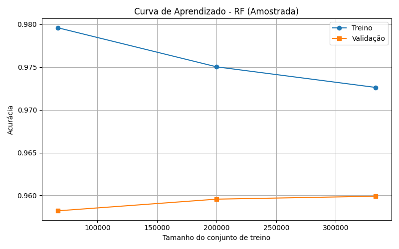
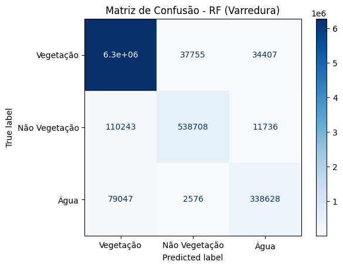
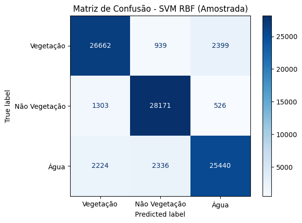
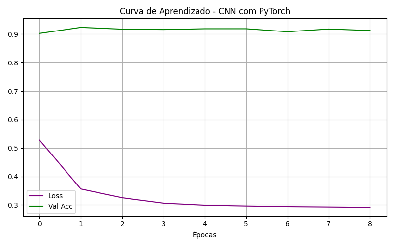
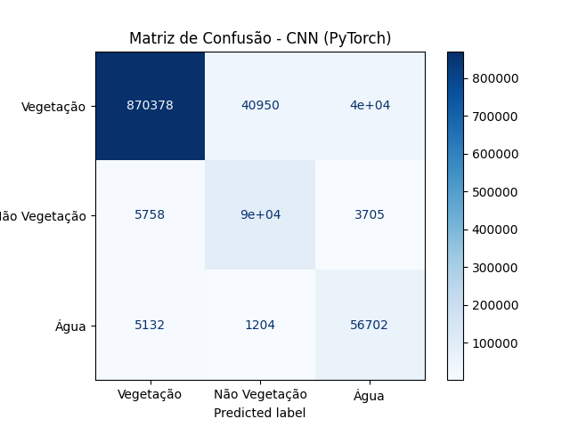

# 🌱 Classificação de Uso e Cobertura do Solo com Aprendizado de Máquina

Este projeto tem como objetivo a **classificação de áreas em Vegetação, Não Vegetação e Água** utilizando imagens multiespectrais do satélite **Sentinel-2**. Três métodos foram aplicados para comparação de desempenho:

- Random Forest com varredura
- SVM com kernel RBF (amostrado)
- CNN treinada com PyTorch

---

## 📦 Pré-processamento das Imagens

- Os arquivos utilizados para treinamento foram **recortes de aproximadamente 1/4 do tamanho original das imagens Sentinel-2**, a fim de reduzir o custo computacional e agilizar os testes de desempenho dos modelos.

- Os arquivos originais estavam no formato **.jp2 (JPEG 2000)**. Para possibilitar o recorte de trechos específicos das imagens e compatibilidade com bibliotecas de processamento, esses arquivos foram convertidos para o formato **.tif (GeoTIFF)**.

- Consequentemente, os arquivos utilizados na classificação final também foram convertidos para **.tif**, com o objetivo de evitar incompatibilidades durante a leitura, visualização e análise dos dados georreferenciados.


- Bandas utilizadas:  
  - **B02 (Azul)**
  - **B03 (Verde)**
  - **B04 (Vermelho)**  
- As imagens foram normalizadas com limite superior de 8000:
  ```python
  def normalize(band):
      return np.where(band > 8000, 1.0, band / 8000)
  ```

---

## 🌲 Método 1: Random Forest (Varredura Direta)

- **Tempo de execução**: 247.62s  
- **Acurácia total**: 0.9628  
- **Divisão de dados**: varredura em imagem recortada  
- **Importância das Bandas**:
  | Banda | Importância |
  |-------|-------------|
  | B02   | 0.29        |
  | B03   | 0.26        |
  | B04   | 0.45        |
- **Curva de aprendizado**:  
  

- **Matriz de Confusão**:  
  

- **Relatório de Classificação**:
  | Classe          | Precision | Recall | F1-score | Suporte   |
  |-----------------|-----------|--------|----------|-----------|
  | Vegetação       | 0.97      | 0.99   | 0.98     | 6.340.687 |
  | Não Vegetação   | 0.93      | 0.82   | 0.87     | 660.687   |
  | Água            | 0.88      | 0.81   | 0.84     | 420.251   |

---

## ⚙️ Método 2: SVM com Kernel RBF (Amostrada)

- **Tempo de execução**: 39.98s  
- **Acurácia total**: 0.8919  
- **Divisão de dados**:  
  - Treinamento + validação: 60.000  
  - Teste: 30.000  
  - **Total**: 90.000 amostras

- **Curva de aprendizado**:  
  

- **Matriz de Confusão**:  
  

- **Relatório de Classificação**:
  | Classe          | Precision | Recall | F1-score | Suporte |
  |-----------------|-----------|--------|----------|---------|
  | Vegetação       | 0.88      | 0.89   | 0.89     | 30.000  |
  | Não Vegetação   | 0.90      | 0.94   | 0.92     | 30.000  |
  | Água            | 0.90      | 0.85   | 0.87     | 30.000  |

---

## 🧠 Método 3: Rede Neural Convolucional (CNN - PyTorch)

- **Dispositivo**: GPU (CUDA)  
- **Tempo de treino**: 443.27s  
- **Épocas**: 9  
- **Melhor Val. Accuracy**: 0.9239  
- **Teste Accuracy**: 0.9133  

- **Topologia da Rede CNN**:
  - Convoluções iniciais com `ReLU` + `MaxPool`
  - Camadas Fully Connected no final
  - Normalização via `nn.BatchNorm2d`
  - Otimizador: `Adam`
  - Função de perda: `CrossEntropyLoss`

- **Curva de aprendizado**:  
  

- **Matriz de Confusão (Teste)**:  
  

- **Relatório de Classificação (Teste)**:
  | Classe          | Precision | Recall | F1-score | Suporte   |
  |-----------------|-----------|--------|----------|-----------|
  | Vegetação       | 0.99      | 0.92   | 0.95     | 951.103   |
  | Não Vegetação   | 0.68      | 0.90   | 0.78     | 99.103    |
  | Água            | 0.57      | 0.90   | 0.69     | 63.038    |

---

## 📌 Considerações Finais

- O **Random Forest** obteve a **maior acurácia geral (96%)**, com bom equilíbrio entre classes.
- A **SVM RBF** apresentou boa performance, mas com tempo de execução inferior e menor generalização.
- A **CNN** foi robusta na generalização, com alta acurácia (~91%) mesmo em grandes volumes de dados, destacando-se para contextos com hardware mais potente.

---

> Projeto acadêmico/teste com base em imagens do Sentinel-2 e classificação supervisionada.
